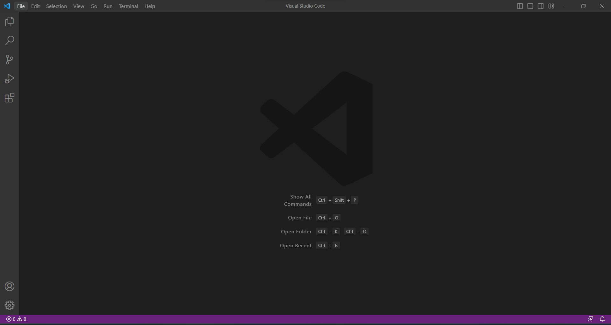
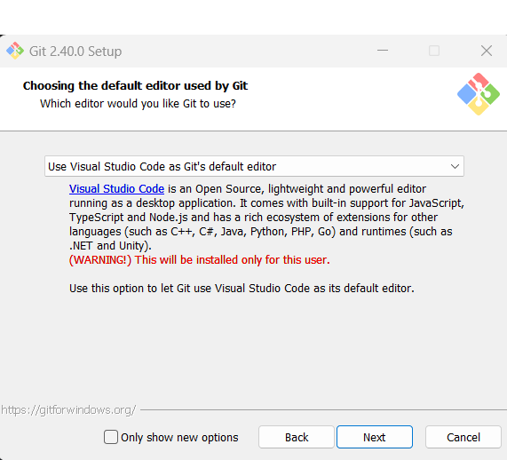
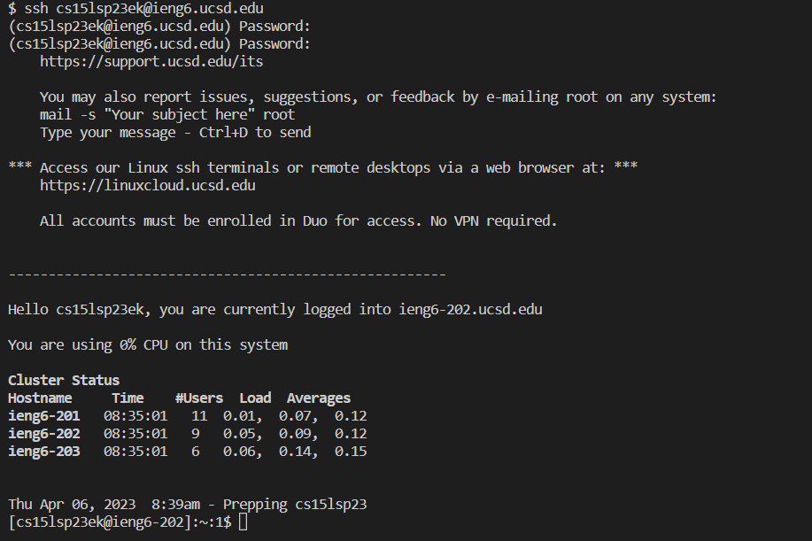
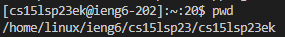
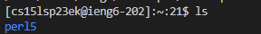
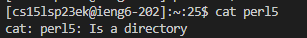
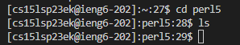

# Lab Report 1
## How to remotely connect to your course specific account:

  **Installations**  
  First you will need to install Visual Studio Code in order to... Go to [https://code.visualstudio.com/download](https://code.visualstudio.com/download) to download and install it (I already have VS code on my computer so I skipped this step).
My editor looks like this when it is opened:
  
  
  You will also need to instal Git. My computer runs windows so I installed git for windows at [https://gitforwindows.org/](https://gitforwindows.org/).
On the set up wizard, I changed the default editor to VS code, besides that, keep all the preferences to the default settings.
  
  
***
  **Remotely connecting**  
  To remotely connect to your course specific account, first set Git Bash to be your default terminal. I followed the steps from [Stackoverflow](https://stackoverflow.com/a/50527994), to do this.
Now open a new terminal and it should be a Git Bash terminal.

Then type: ssh cs15lsp23zz@ieng6.ucsd.edu, but with your account name. It will prompt you for a password, type your password in to log in. Mine looks like this:
  
  
  It might ask you if you want to continue to log in, which you will type yes. Mine did not ask me this question.
  
***
  **Run some commands**  
Now you should be able to run some commands. Here are some commands I ran:  
Note: ieng6 wasn't letting me log in anymore, so I used ieng6-202 to remote connect to for these screenshots)  
1) pwd (tells you what directory your currently in)  

2) ls (tells you what is in the directory)  

3) cat per15 (will return the contents of perl5, since it is a folder not a file, it tells us that perl5 is a directory)

4) cd per15 (changes the directory to perl5)  
5) ls perl5 (tells us the file names in the directory, there's nothing in the directory so nothing happened)

