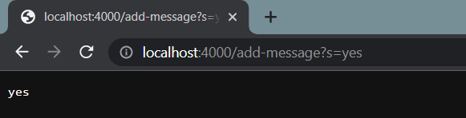
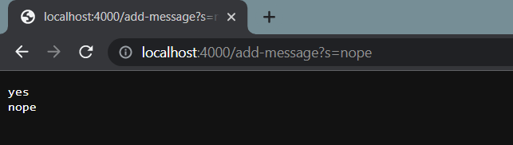
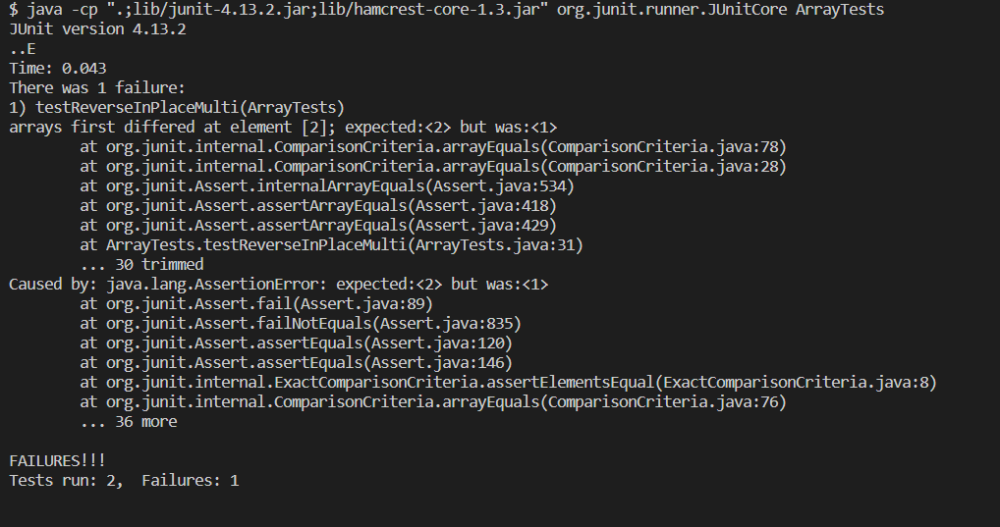

# Lab Report 2  
  
## Part 1
  
Code for my StringServer:  
```
import java.io.IOException;
import java.net.URI;
import java.util.ArrayList;

class Handler implements URLHandler {
    String stringOutput = "";

    public String handleRequest(URI url) {
        if (url.getPath().equals("/")) {
            return this.stringOutput;
        } 
        else {
            if (url.getPath().contains("/add-message")) {
                String[] parameters = url.getQuery().split("=");
                if (parameters[0].equals("s")) {
                    this.stringOutput += parameters[1] + "\n";
                    return this.stringOutput;
                }
                else{
                    return "invalid command";
                }
            }
            else{
                return "invalid query";
            }
        }
    }
}

class StringServer {
    public static void main(String[] args) throws IOException {
        if(args.length == 0){
            System.out.println("Missing port number! Try any number between 1024 to 49151");
            return;
        }

        int port = Integer.parseInt(args[0]);

        Server.start(port, new Handler());
    }
}
```  

Screenshots of the server working:  
1. typing in `http://localhost:4000/add-message?s=yes`:  
  
  The methods called after I loaded this in the browser is `handleRequest(URI url)` with the arguement `url` set to `http://localhost:4000/add-message?s=yes`. The field of Handler, stringOutput, was initialized as an empty string `""` before the handleRequest method was called. After its called, stringOutput is updated to be `"yes\n"`.
2. typing in `http://localhost:4000/add-message?s=nope`:  
  
  The methods called after I loaded this second url in the browser is `handleRequest(URI url)` with the arguement url being `http://localhost:4000/add-message?s=nope`. The field, stringOutput, was the string `"yes\n"` and is updated to equal `"yes\nnope\n"`.

## Part 2:

Bug: `ArrayExamples.java` in the method: `reverseInPlace`

Failure inducing input (JUnit test):  
```
@Test 
  public void testReverseInPlaceMulti() {
    int[] input1 = {3,2,1,0};
    ArrayExamples.reverseInPlace(input1);
    assertArrayEquals(new int[]{0,1,2,3}, input1);
	}
```
Input that doesn't produce failure (JUnit test):  
```
@Test 
  public void testReverseInPlace() {
    int[] input1 = {3,3};
    ArrayExamples.reverseInPlace(input1);
    assertArrayEquals(new int[]{3,3}, input1);
  }
```
JUint output in terminal:  
  

Original Code:
```
 // Changes the input array to be in reversed order
  static void reverseInPlace(int[] arr) {
    for(int i = 0; i < arr.length; i += 1) {
      arr[i] = arr[arr.length - i - 1];
    }
  }
```
Fixed Code:
```
static void reverseInPlace(int[] arr) {
    for(int i = 0; i < arr.length/2; i += 1) {
      int temp = arr[i];
      arr[i] = arr[arr.length - i - 1];
      arr[arr.length - i -1] = temp;
    }
  }
```  
The changes I made were to use a temporary variable `temp` to store the value at the index of the array being replaced, `arr[i]`, by `arr[arr.length-i-1]`. Then I can set `arr[arr.length-i-1]` to `temp` to reverse there order. I also divided the `arr.length` in the for loop by 2, so it will only go through half the list. At half the list, the list will be fully reversed, if we go through the whole list, the list will reversed back to the orginal order.


## What I learned:  
Something new I learned was the process of writing code that will run on a webpage when the webpage is loaded. I thought that this was really interesting that the handleRequest method just uses conditionals to run and uses the actual URL typed into the browser as a argument and isn't some super complicated method. 
