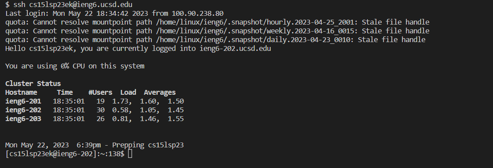
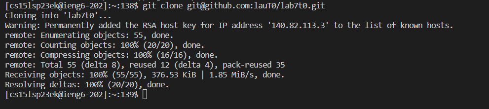
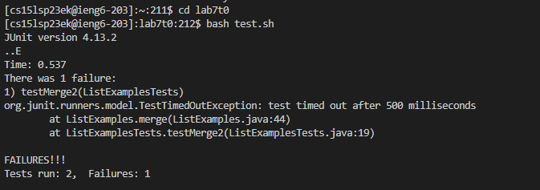
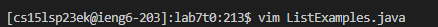
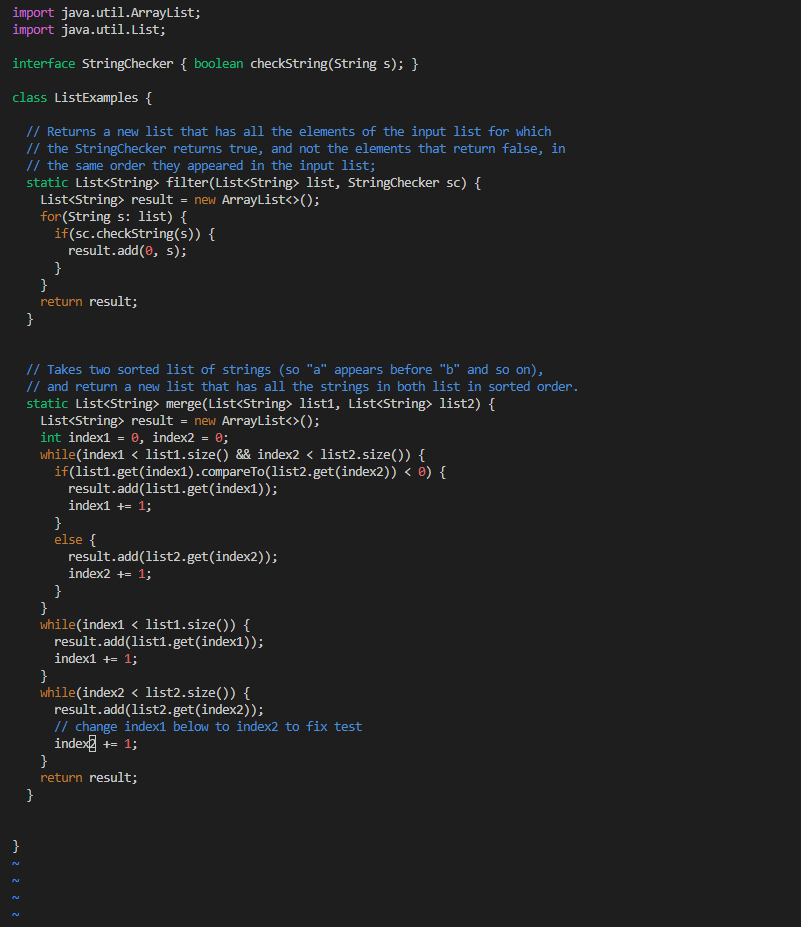
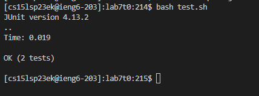
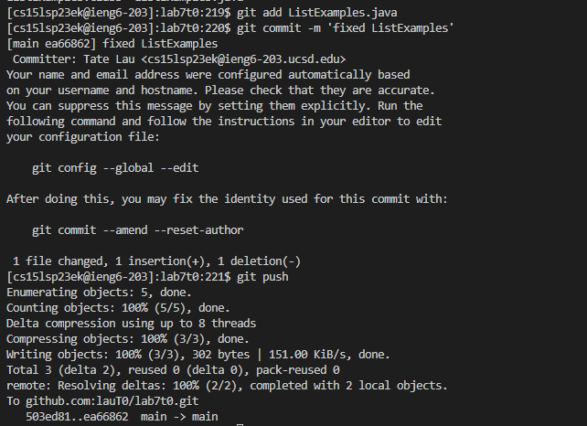

# Lab Report 4  
## Steps and Explanations:  
  
4) Log into ieng6  
-   
- I typed: `ssh cs15lsp23ek@ieng6.ucsd.edu<enter>`, this logs me into my ieng6 account.  
  
5) Clone your fork of the repository from your Github account  
-   
- I typed: `git clone <ctrl + v><enter>`, this pasted the ssh of my fork on GitHub which I had previously copied to my clipboard. The command completed to `git clone git@github.com:lauT0/lab7t0.git`.  
  
6) Run the tests, demonstrating that they fail  
-   
- I typed: `cd lab7t0<enter>` to change the directory to lab7t0 (which is what I named my fork)  
- I typed: `bash t<tab><enter>`, which autocompleted to `bash test.sh` to run the tests using the given bash script.  
  
7) Edit the code file to fix the failing test  
-   
- I typed: `vim L<tab>.<tab><enter>`, which autocompleted to `vim ListExamples.java`, so I could fix the ListExamples.java code.  
-   
- I typed: `/index1<enter>nnnnnnnexi2<esc>:wq<enter>`. Firstly, the `/index1<enter>` searches for "index1" in the vim editor. `n` is the key to get to the next instance of "index1" that was found. I pressed it 7 times to get to the correct spot. `e` jumps to the end of the word, putting my cursor on the "1". `x` deletes that letter and `i` enters insert mode in vim. Now, I type `2` to make "index1" into "index2". `<esc>` leaves insert mode. Finally, I can save and exit vim with `:wq`.  
  
8) Run the tests, demonstrating that they now succeed  
-   
- I typed: `<up><up><enter>` to get the `bash test.sh` that was 2 up in my history so I could run the tests again. The output shows that the tests now pass.  
  
9) Commit and push the resulting change to your Github account (you can pick any commit message!)  
-   
- I typed: `git add ListExamples.java<enter>` in order to add my changes to ListExamples  
- I tyyed: `git commit -m 'fixed ListExamples'<enter>` in order to commit my changes with "fixed ListExamples" as my commit message.  
- I typed: `git push<enter>` to push the commits to the GitHub repository.  
