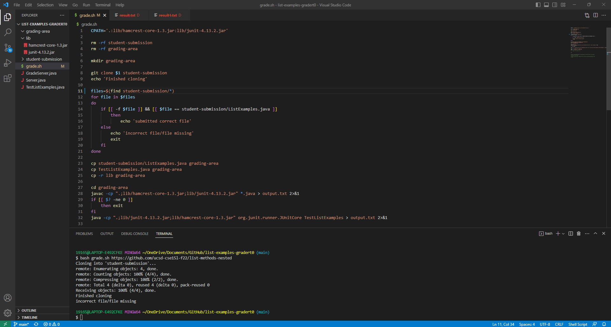
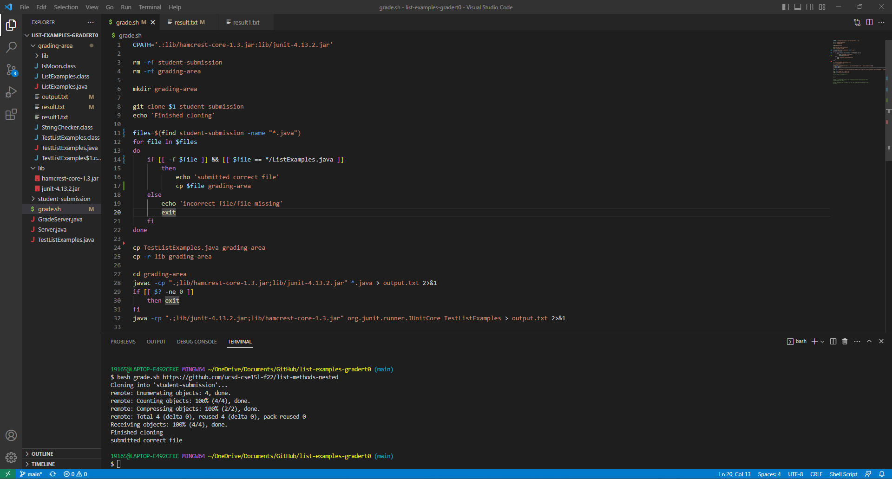

# Lab Report 5  
## Part 1 Debugging Senario:  
1. student original post:  
* I'm using Windows 11 and VScode.  

* When I run the grade.sh for with the repository: https://github.com/ucsd-cse15l-f22/list-methods-nested. The output in my code is "incorrect file/file missing" when it should have found the file. I'm not sure why this is happening it gives correct output for all other sample repos.  
    

* The error is occuring somewhere in line 11 to 21 in my grade.sh script, where it finds all the files in the repo, and determines if it is the correct file.  
  
2. TA response:  
   The sample repository you're using has the correct file nested within a file called PA1. On line 11, you store all files found with the find command: `find student-submission/*`, however, this is storing the path to the directory, `student-submission/pa1` as well as the path to the ListExamples file, `student-submission/pa1/ListExamples.java`.  
   Your code checks the first path, and determines its the wrong file and exits. Even if you checked `student-submission/pa1/ListExamples.java` this doesn't match `student-submission/ListExamples.java`, so it will not work either.  
   To resolve this, I suggest using the command `find <directory> -name "*.java"` at line 11. This will find all the java files within a directory recursively. Then at line 14, in your if statement should check for a pattern instead, so `student-submission/pa1/ListExamples.java` will return true. You will also have to adjust your code for copying the ListExample.java file on line 23, since it will not match the pattern.
   
3. student followup:  
   Ok, thank you so much! Here is my fixed immplementation:  
     
   
   full description of the bug:  
   In Line 11, `files=$(find student-submission/*.java)`, stores all files found, which is: `student-submission/pa1` and `student-submission/pa1/ListExamples.java`.  
   The code checks if the first path is a file, it is not, so it exits. Even if it didn't check non files, `student-submission/pa1/ListExamples.java` doesn't match `student-submission/ListExamples.java`, so it will also exit.  
   To resolve this, I used `files=$(find student-submission -name "*.java")` at line 11, which only stores the java files. Then at line 14, in the if statement, I changed  `[[ $file == student-submission/ListExamples.java ]]` to `[[ $file == */ListExamples.java ]]`, so `student-submission/pa1/ListExamples.java` will return true. Then I copy that file into the the grading area.  

4. all the information needed about the setup:  
  * The file & directory structure needed: https://github.com/lauT0/list-examples-gradert0.git  
  * The contents of each file before fixing the bug:  
    grade.sh:  
    ```
    CPATH='.:lib/hamcrest-core-1.3.jar:lib/junit-4.13.2.jar'

    rm -rf student-submission
    rm -rf grading-area

    mkdir grading-area

    git clone $1 student-submission
    echo 'Finished cloning'

    files=$(find student-submission/*)
    for file in $files
    do
        if [[ -f $file ]] && [[ $file == student-submission/ListExamples.java ]]
            then 
                echo 'submitted correct file'
        else
            echo 'incorrect file/file missing'
            exit
        fi
    done

    cp student-submission/ListExamples.java grading-area
    cp TestListExamples.java grading-area
    cp -r lib grading-area

    cd grading-area
    javac -cp ".;lib/hamcrest-core-1.3.jar;lib/junit-4.13.2.jar" *.java > output.txt 2>&1
    if [[ $? -ne 0 ]]
        then exit
    fi
    java -cp ".;lib/junit-4.13.2.jar;lib/hamcrest-core-1.3.jar" org.junit.runner.JUnitCore TestListExamples > output.txt 2>&1

    tail -n +2 output.txt > result.txt
    head -n 1 result.txt > result1.txt
    ```  
  * The full command line (or lines) you ran to trigger the bug:  
    `bash grade.sh https://github.com/ucsd-cse15l-f22/list-methods-nested`  
  * A description of what to edit to fix the bug:  
    line 11: `files=$(find student-submission/*)` to `files=$(find student-submission -name "*.java")`  
    line 14: `[[ $file == student-submission/ListExamples.java ]]` to `[[ $file == */ListExamples.java ]]`  
    added line 17: `cp $file grading-area`  
    deleted: line 23: `cp student-submission/ListExamples.java grading-area`  

## Part 2 Reflection:  
I found writing scripts to be really cool. I heard the word "script" or "downloading scripts" thrown around on the internet, but I never knew what they where talking about, I just thought it was some computer thing. So it was super interesting to actually write a script myself and learn about what they can do.  
